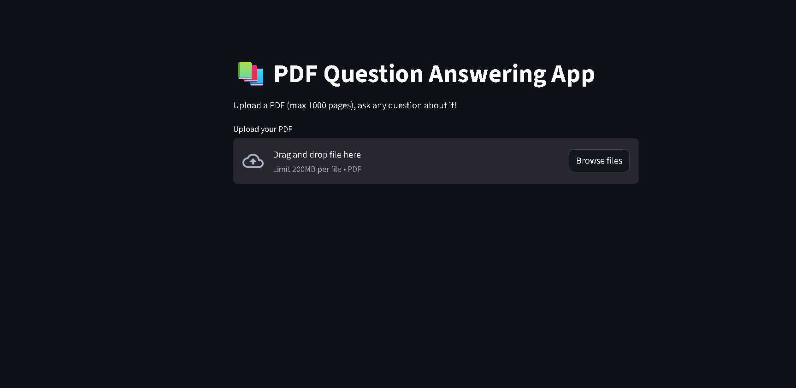

# PDF Question Answering using Retrieval-Augmented Generation (RAG)

A lightweight Retrieval-Augmented Generation (RAG) system that enables users to ask natural language questions from PDF documents.
The system retrieves relevant document sections using vector similarity search and generates answers grounded in the retrieved context using a language model.

---

## Overview

Large Language Models often hallucinate when answering questions without context.
This project mitigates that problem by retrieving relevant document content before generating an answer.

Pipeline:

1. Extract text from uploaded PDFs
2. Split documents into smaller chunks
3. Convert chunks into embeddings
4. Store embeddings in a FAISS vector index
5. Retrieve the most relevant chunks for a user query
6. Provide retrieved context to the LLM
7. Generate a grounded answer

## Key Features

- Retrieval-Augmented Generation pipeline for document question answering
- Semantic search using sentence embeddings
- Efficient vector indexing with FAISS
- Context-aware answer generation using FLAN-T5
- Interactive Streamlit web interface
- Modular architecture supporting different embedding and LLM models
---
## System Architecture

The system follows a Retrieval-Augmented Generation (RAG) pipeline.

PDF → Text Extraction → Chunking → Embeddings → Vector Index (FAISS)
                                                     ↓
                                                User Query
                                                     ↓
                                            Similarity Retrieval
                                                     ↓
                                               Context Assembly
                                                     ↓
                                                 FLAN-T5
                                                     ↓
                                                   Answer

---


## Tech Stack

**Language**

* Python

**Libraries**

* LangChain
* HuggingFace Transformers
* SentenceTransformers
* FAISS
* PyPDF
* Streamlit

**Models**

* Embedding Model: `all-MiniLM-L6-v2`
* Generation Model: `FLAN-T5`

---

## Project Structure

```
PDF-QUERY-AI
│
├── app.py
├── pdf_qa_engine.py
├── requirements.txt
├── README.md
└── .gitignore
```

**app.py**
Implements the Streamlit web interface for uploading PDFs and asking questions.

**pdf_qa_engine.py**
Contains the core RAG pipeline including document processing, embeddings, vector store creation, and retrieval.

---

## Installation

Clone the repository:

```
git clone https://github.com/dhairyaaa1001/pdf-rag-question-answering.git
cd pdf-rag-question-answering
```

Create a virtual environment:

```
python -m venv venv
source venv/bin/activate
```

Install dependencies:

```
pip install -r requirements.txt
```

---

## Running the Application

Start the Streamlit interface:

```
streamlit run app.py
```

Open the application in your browser:

```
http://localhost:8501
```

Upload a PDF and start asking questions about the document.

---

## Example Use Cases

* Research paper exploration
* Legal document analysis
* Financial report summarization
* Academic study material QA
* Knowledge base search

---

## Future Improvements

* Support multiple document collections
* Add hybrid retrieval (BM25 + embeddings)
* Improve chunking strategies
* Deploy the application to cloud platforms
* Add conversational memory

---

## License

This project is available for educational and research purposes.
